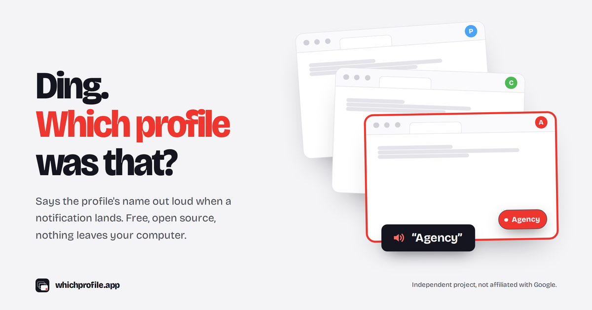

# WhichProfile

[](LICENSE)

Extension Chrome qui **annonce quel profil Chrome vient de recevoir une notification**.

- Site : https://whichprofile.app — confidentialité : https://whichprofile.app/privacy
- **Disponible sur le Chrome Web Store** : https://chromewebstore.google.com/detail/nkfkdanbfikhpkdhebfemmplgagjfllg
- Contact : hello@whichprofile.app

Votre système vous dit quel service vient de notifier, jamais *quel compte*. WhichProfile, installée dans chacun de vos profils, annonce à voix haute le service et le libellé du profil, ou joue un motif sonore propre à ce profil. La liste des sites couverts est plus bas, dans « Sites couverts ».

- Aucune donnée ne quitte l'appareil. Aucune requête réseau. Aucun contenu de message lu, transmis ou stocké.
- Manifest V3, JavaScript sans dépendance, sans build.
- Interface et détection en 8 langues : anglais, français, espagnol, portugais (Brésil et Portugal), italien, allemand, néerlandais. La langue de l'interface suit celle de Chrome ; la voix par défaut suit la langue de l'interface (le select « Voix » prime toujours).

## Installation (à répéter dans chaque profil)

**Depuis le Chrome Web Store (recommandé)** : ouvrir la fiche dans chaque profil Chrome → **Ajouter à Chrome** → puis l'étape 5 ci-dessous (Réglages).

**Depuis le code (développement)** :

1. Ouvrir `chrome://extensions` dans le profil.
2. Activer le **Mode développeur** (en haut à droite).
3. **Charger l'extension non empaquetée** → choisir le dossier `whichprofile/`.
4. Épingler l'icône WhichProfile si vous voulez le popup à portée de main.
5. Ouvrir les **Réglages** (popup → Réglages, ou clic droit sur l'icône → Options), vérifier le compte détecté, choisir le libellé, puis **Tester**.

Chaque profil a sa propre configuration : donnez un libellé (et en mode son, un motif) différent à chacun.

Après une mise à jour du code : `chrome://extensions` → bouton ↻ de WhichProfile, dans chaque profil, puis recharger les onglets surveillés.

## Configuration

| Réglage | Effet |
|---|---|
| Libellé annoncé | Ce que la voix dit après le service. Par défaut : la partie avant @ de l'email du profil, ou « profil sans compte ». |
| Mode | **Voix** (synthèse vocale de Chrome) ou **Son** (motif synthétisé, aucun fichier audio). |
| Motif sonore | ding, double, triple, grave, aigu. |
| Langue / Voix | Liste des voix installées. « Automatique » = première voix de la langue (fr-FR par défaut). |
| Sources Gmail | Messages chat : **activé** par défaut. Nouveaux e-mails : **désactivé** par défaut. |
| Muet | Plus aucune annonce ; le popup liste quand même les derniers pings. |
| Mode DEBUG | Journalise dans la console (voir « Ajuster la détection du chat Gmail »). |

## Sites couverts (Sites covered)

Les **15 sites** surveillés (liste fermée, identique à `lib/sites.js` et aux `matches` du manifest) :

| # | Site | Adresse | Détection |
|---|---|---|---|
| 1 | Gmail | `mail.google.com` | Hook notifications + adaptateur chat (aria-label) + titre pour les e-mails (opt-in) |
| 2 | Google Chat | `chat.google.com` | Hook notifications + compteur « (N) » en tête du titre |
| 3 | WhatsApp Web | `web.whatsapp.com` | Hook notifications + compteur du titre |
| 4 | Messenger | `www.messenger.com` | Hook notifications + compteur du titre |
| 5 | Facebook | `www.facebook.com` | Hook notifications + compteur du titre |
| 6 | Instagram | `www.instagram.com` | Hook + titre **non garantis** (détection de base), adaptateur prévu en v1.1 |
| 7 | LinkedIn | `www.linkedin.com` | Hook notifications + compteur du titre |
| 8 | Slack | `app.slack.com` | Hook notifications + compteur du titre |
| 9 | Discord | `discord.com` | Hook notifications + compteur du titre |
| 10 | X | `x.com` | Hook notifications + compteur du titre |
| 11 | Outlook (professionnel) | `outlook.office.com` | Hook notifications + compteur du titre |
| 12 | Outlook (personnel) | `outlook.live.com` | Hook notifications + compteur du titre |
| 13 | Microsoft Teams (professionnel) | `teams.microsoft.com` | Hook + titre **non garantis** (détection de base), pas d'adaptateur dédié |
| 14 | Microsoft Teams (personnel) | `teams.live.com` | Hook + titre **non garantis** (détection de base), pas d'adaptateur dédié |
| 15 | Microsoft Teams (nouvelle adresse) | `teams.cloud.microsoft` | Hook + titre **non garantis** (détection de base), pas d'adaptateur dédié |

Plusieurs signaux pour un même événement (hook + titre + adaptateur) donnent **une seule** annonce : WhichProfile ignore les nouveaux signaux d'un site pendant **12 s** après une annonce. On annonce une identité, pas chaque message.

Le popup garde, repliés sous « Derniers pings », les **5 derniers pings** : heure, site, source (`notification`, `title`, `gmail-chat`, `gmail-mail`) et s'il a été annoncé ou pourquoi il ne l'a pas été (muet, doublon, source désactivée). C'est le premier endroit où regarder quand une annonce manque ou se répète, sans passer par DEBUG.

## Agent mode — why

Les agents IA qui naviguent pour vous (navigateurs agentiques, extensions d'assistant, automatisations) ont le même angle mort que macOS : ils voient une page, pas le **profil Chrome** dans lequel elle est ouverte. Un agent qui doit « répondre depuis le compte client » ou « ne rien toucher au compte perso » n'a aucun moyen fiable de savoir où il est.

L'Agent mode, **désactivé par défaut**, rend le profil lisible sur chaque page :
- un petit chip bas-droite avec le libellé du profil (Shadow DOM fermé, sans effet sur la mise en page ; clic = masqué pour cet onglet) ;
- dans le shadow root, `role="status"` et `aria-label="Chrome profile: <libellé>"`, lus par les lecteurs d'écran et les agents qui passent par l'arbre d'accessibilité ;
- le texte du chip, pour les agents qui travaillent sur des captures d'écran.

Le libellé n'apparaît qu'à l'écran et dans l'arbre d'accessibilité : les scripts des pages ne peuvent pas le lire. L'élément hôte, dans le DOM de la page, n'a ni attribut ni texte, et son nom est fixe (`whichprofile-chip`). Le libellé visible est du contenu généré CSS : la recherche dans la page (`window.find`) ne le trouve pas.

L'activation demande l'accès à **tous les sites** et la permission `scripting` (permissions optionnelles). En cas de refus, le mode reste désactivé. La désactivation retire le script et rend ces permissions. Le chip n'ajoute que cet élément et ne lit rien de la page.

**Pour l'activer — 2 étapes, dans cet ordre :**
1. Réglages → **Libellé annoncé** : remplacer le libellé par défaut (tiré de votre e-mail) par un nom neutre (« Pro », « Agence », « Client A »).
2. Réglages → **Agent mode** : activer, puis accepter la permission demandée.

Pourquoi l'ordre compte : le libellé s'affiche sur chaque page (à l'écran, et pour les lecteurs d'écran). Tant qu'il est dérivé de votre adresse e-mail — le cas par défaut — l'interrupteur Agent mode reste inactif et affiche un message : ce n'est pas un bug, c'est pour ne pas afficher votre adresse partout. Une prochaine version proposera le changement de libellé directement depuis l'interrupteur.

## Limites connues

- **Onglet fermé** : les notifications push reçues par le service worker d'un site quand son onglet est fermé sont invisibles pour l'extension. Gardez les onglets ouverts (épinglés).
- **Sélecteurs Gmail fragiles** : le chat Gmail ne change pas le titre de l'onglet. WhichProfile lit les `aria-label` de la nav. Gmail peut changer son DOM à tout moment → bloc `SELECTORS` en tête de `adapters/gmail.js` et mode DEBUG.
- **Auto-détection du compte** : nécessite un compte Google connecté *à Chrome* (profil). Sinon le libellé est « profil sans compte », modifiable dans les réglages.
- **Plusieurs messages en moins de 12 s sur le même site** : une seule annonce.
- **Gmail : e-mail ou chat ?** Une notification Gmail qui ne vient pas d'une frame de chat est comptée comme « e-mail » : si les e-mails sont désactivés, elle est ignorée et c'est l'adaptateur chat qui prend le relais.

## Pourquoi ça n'a pas sonné ?

Ouvrir le popup de l'extension **dans le profil concerné** : il liste les 5 derniers signaux reçus, avec leur sort. Puis :

| Constat | Explication |
|---|---|
| **Le message est arrivé dans une conversation déjà ouverte et affichée** | Comportement attendu. Le site le marque lu aussitôt : pas de compteur qui augmente, souvent pas de notification. Rien à annoncer, puisque vous regardez déjà ce profil. |
| Aucune ligne dans le popup | Aucun signal n'est arrivé. L'onglet du service était-il ouvert ? Une notification reçue onglet fermé est invisible pour une extension. Après une mise à jour ou un rechargement de l'extension, rechargez aussi les onglets surveillés. |
| « non annoncé (doublon) » | Un autre signal du même site a été annoncé moins de 12 s avant. On annonce une identité, pas chaque message. |
| « non annoncé (muet) » | Le mode Muet est activé (popup ou réglages). |
| « non annoncé (source désactivée) » | Gmail : les nouveaux e-mails sont désactivés par défaut (Réglages → Sources Gmail). Une notification Gmail qui ne vient pas du chat est comptée comme e-mail. |
| Un nouveau message arrive juste après avoir tout lu, sans ligne dans le popup | Depuis la v1.0.1, un titre d'onglet sans compteur ne remet le compteur à zéro qu'après 6 s continues sans compteur : c'est ce qui empêche un titre qui clignote de déclencher des annonces en boucle. Un message arrivé dans les ~6 s qui suivent la lecture de tout peut donc passer inaperçu par le titre ; la notification du site, elle, est annoncée si les notifications sont autorisées pour ce site. Au-delà, « (1) » après avoir tout lu est bien annoncé. |
| Le site ne notifie pas (notifications non autorisées) | Depuis la v1.0.1, une notification n'est prise en compte que si le site a la permission d'en afficher (`Notification.permission === "granted"`). Sinon, seul le compteur du titre peut déclencher une annonce. |
| « ✓ annoncé » mais rien entendu | Volume du Mac, sortie audio, ou voix de synthèse absente : Réglages → Tester. |
| Rien dans les 10 s après l'ouverture d'un onglet | Voulu : la première lecture du compteur sert de référence, pour ne pas annoncer les non-lus déjà présents au chargement. |
| Chat Gmail jamais détecté | Voir « Ajuster la détection du chat Gmail » ci-dessous (Gmail dans une autre langue que le français ou l'anglais : non vérifié). |

## Ajuster la détection du chat Gmail

1. Réglages → activer **Mode DEBUG**.
2. Recharger l'onglet Gmail, ouvrir la console (⌥⌘J).
3. Dans le menu de contexte de la console (« top » par défaut), regarder la frame principale **et** les frames `mail.google.com/chat/…`.
4. Chaque changement d'aria-label candidat s'affiche dans un tableau : libellé, contribution au compte, chemin par rôles. Se faire envoyer un message chat et repérer la ligne qui change.
5. Modifier le bloc `SELECTORS` en tête de `adapters/gmail.js`, recharger l'extension, recommencer.

Les décisions du service worker (ping ignoré / absorbé / annoncé) sont visibles dans `chrome://extensions` → WhichProfile → « service worker ».

## Développement

```sh
node --test                    # tests automatisés, Node ≥ 18, aucune dépendance
python3 scripts/make-icons.py  # régénère icons/16, 32, 48, 128.png depuis icons/icon.svg (Python standard, sans PIL)
CHROME=/chemin/vers/chrome-for-testing node scripts/screenshots.mjs  # captures brutes Store → store/screenshots/raw/
```

Sous Node 22, `node --test test/` (avec un répertoire) ne fonctionne pas : utiliser `node --test` sans argument.

## Publier sur le Chrome Web Store

```sh
sh scripts/pack.sh   # tests, puis dist/whichprofile-<version>.zip (sans .git, test/, scripts/, store/, CLAUDE.md, README.md)
```

Puis suivre `store/SUBMISSION.md`, dans l'ordre du formulaire. Pour une nouvelle version : incrémenter `version` dans `manifest.json`, relancer le script.

## Ajouter une langue

1. Copier `_locales/en/messages.json` dans `_locales/<code>/` (code Chrome : `ja`, `pt_BR`…), traduire les `message`, mettre `localeCode` à `<code>`.
2. Ajouter la ligne `<code>: [...]` dans `UNREAD_WORDS` (`lib/parse.js`), avec les variantes de genre et de nombre du mot « non lu ».
3. Ajouter la voix par défaut `<code>: '<lang-TTS>'` dans `DEFAULT_TTS_LANG` (`lib/config.js`), puis les mots « Espaces » et boîte de réception de la langue dans `SELECTORS` (`adapters/gmail.js`).
4. Lancer `node --test` : `test/i18n.test.js` échoue tant que la langue manque quelque part ; ajouter sa ligne dans `test/languages.test.js`.

Toute modification de la liste des sites se fait **dans `lib/sites.js` et `manifest.json`** ; `test/sites.test.js` échoue si les deux divergent.

## Tests manuels (dans vos vrais profils)

- [ ] **T1** — Chargement non empaqueté dans le profil A → les réglages affichent l'email du profil A.
- [ ] **T2** — Bouton « Tester » → la voix dit « Test, {libellé} » ; en mode son, le motif choisi joue.
- [ ] **T3** — Le profil B envoie un message chat Gmail au profil A → annonce en moins de 3 s avec le libellé de A, **une seule fois**.
- [ ] **T4** — Deux profils, deux messages → deux annonces distinctes, **une seule par message** (le popup de chaque profil montre les doublons absorbés).
- [ ] **T5** — WhatsApp Web, message entrant → « WhatsApp, {libellé} ».
- [ ] **T6** — Rechargement de l'onglet Gmail avec des non-lus déjà présents → **aucune** annonce.
- [ ] **T7** — Muet → aucune annonce, le popup liste les pings avec « non annoncé (muet) ».
- [ ] **T8** — Profil non connecté à Chrome → libellé « profil sans compte », modifiable.
- [ ] **T9** — Gmail en DEBUG → les mutations candidates sont visibles en console, `SELECTORS` modifiable sans casser le reste.
- [ ] **T10** — Agent mode activé (permission acceptée), libellé « Serendyme » : un agent IA à qui l'on demande « dans quel profil Chrome es-tu ? » lit la page (écran ou arbre d'accessibilité) et trouve « Chrome profile: Serendyme ». Avec le libellé par défaut tiré de l'e-mail, l'activation est refusée avec un message. Refus de la permission → reste désactivé ; désactivation → chips retirés des onglets ouverts, permissions rendues (visible dans `chrome://extensions` → Détails).

## Confidentialité

Voir `store/privacy.md`. En bref : l'email du profil est lu localement pour proposer un libellé, stocké dans ce profil uniquement, et jamais transmis.

## Licence

MIT — voir [LICENSE](LICENSE). Police Bricolage Grotesque sous SIL Open Font License 1.1 (`ui/fonts/OFL.txt`).
